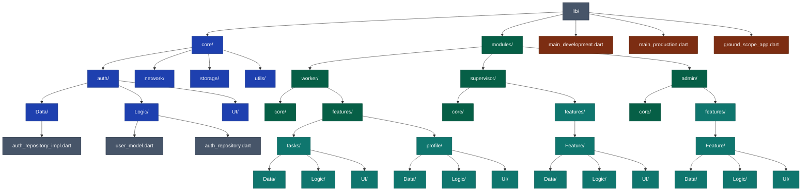

# GroundScope

**GroundScope** is a graduation project developed by students of  **Zagazig National University** , aiming to provide a comprehensive system for managing and organizing **airport ground operations** — including task allocation, workforce monitoring, supervision, and operational reporting.

---

## 📌 Introduction

GroundScope offers  **three primary interfaces** , tailored to user roles:

* **Worker** : Perform daily operational tasks efficiently.
* **Supervisor** : Monitor teams, assign tasks, and review reports.
* **Admin** : Full control over system settings, user management, and configuration.

---

## 🎯 Project Objectives

* Improve workflow organization on airport grounds.
* Enhance communication between workers and supervisors.
* Provide a centralized administrative dashboard.
* Generate real-time reports to support informed decision-making.

---

## 🏗️ Architecture

The project follows a  **Modular Architecture + MVVM pattern** , designed to:

* Facilitate scalability and future enhancements.
* Ensure clear separation of responsibilities.
* Promote code reusability and maintainability.
* Maintain a professional and organized project structure.

---

## 📁 Project Structure

<pre class="overflow-visible!" data-start="1393" data-end="1859" data--h-bstatus="0OBSERVED">

<code class="whitespace-pre! language-text" data--h-bstatus="0OBSERVED">lib/
 ├── core/
 │    ├── auth/
 │    │    ├── data/
 │    │    ├── domain/
 │    │    └── presentation/
 │    ├── network/
 │    ├── storage/
 │    └── utils/
 │
 ├── modules/
 │    ├── worker/
 │    │    ├── core/
 │    │    └── features/
 │    ├── supervisor/
 │    │    ├── core/
 │    │    └── features/
 │    └── admin/
 │         ├── core/
 │         └── features/
 │
 ├── ground_scope_app.dart
 ├── main_development.dart
 └── main_production.dart
</code>

</pre>

---

## 👥 Team Members

This project was developed by a team of **9 students** from  **Zagazig National University** :

1. Ahmed Elbaz Talba Elbaz Sobah
2. Mohamed Hosni Mohamed Hassan
3. Amr Mohamed Abdelhamid Badr
4. Abdullah Mohamed Abdullah Nour El-Din
5. Shaimaa Mohamed Suleiman Ibrahim
6. Alyaa Fayez Mohamed Mahmoud
7. Mahetab Abdelwahed Abdelmonem
8. Wissam Karam Shahata Ahmed El-Zuhairy
9. Nada Mohamed Gamal El-Bayoumi Mohamed

---

## 🎨 Design

> UI/UX screenshots or Figma links will be added in future updates.

---

## 📄 License

This project is **for academic purposes only** and may not be used for commercial purposes.
