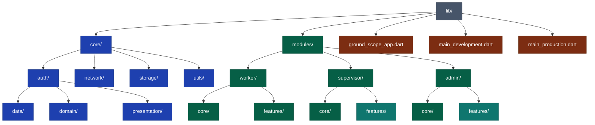

# GroundScope

**GroundScope** هو مشروع تخرج لطلاب **جامعة الزقازيق الأهلية**، ويهدف إلى بناء نظام متكامل لإدارة وتنظيم خدمات العمليات الأرضية في المطارات — مثل توزيع المهام، متابعة العمال، الإشراف، وإعداد التقارير التشغيلية.

## 📌 مقدمة

يوفّر GroundScope ثلاث واجهات رئيسية حسب دور المستخدم:

* **العامل (Worker)**: تنفيذ المهام اليومية.
* **المشرف (Supervisor)**: متابعة الفرق، توزيع المهام، مراجعة التقارير.
* **المدير (Admin)**: تحكم كامل في النظام والمستخدمين والإعدادات.

## 🎯 أهداف المشروع

* تحسين تنظيم سير العمل على أرض المطار.
* تعزيز التواصل بين العمال والمشرفين.
* توفير لوحة تحكم مركزية للإدارة.
* إنشاء تقارير لحظية تدعم اتخاذ القرار.

## 🏗️ المعمارية المستخدمة

يعتمد المشروع على **Modular Architecture + MVVM** بهدف:

* دعم التوسع بسهولة.
* فصل واضح للمسؤوليات.
* سهولة إعادة الاستخدام.
* تنظيم الهيكلة بشكل احترافي.

## 📁 هيكل المشروع

```text
lib/
 ├── core/
 │    ├── auth/
 │    │    ├── data/
 │    │    ├── domain/
 │    │    └── presentation/
 │    ├── network/
 │    ├── storage/
 │    └── utils/
 │
 ├── modules/
 │    ├── worker/
 │    │    ├── core/
 │    │    └── features/
 │    ├── supervisor/
 │    │    ├── core/
 │    │    └── features/
 │    └── admin/
 │         ├── core/
 │         └── features/
 │
 ├── ground_scope_app.dart
 ├── main_development.dart
 └── main_production.dart
```

## 👥 الفريق

هذا المشروع تم تطويره بواسطة فريق مكون من 9 طلاب من **جامعة الزقازيق الأهلية**:

1. أحمد الباز طلبة الباز صبح
2. محمد حسني محمد حسن
3. عمرو محمد عبد الحميد بدر
4. عبد الله محمد عبد الله نور الدين
5. الشيماء محمد سليمان ابراهيم
6. علياء فايز محمد محمود
7. ماهيتاب عبد الواحد عبد المنعم
8. وسام كرم شحاته احمد الزهيري
9. ندي محمد جمال البيومي محمد

## 🎨 التصميم

> سيتم إضافة لقطات التصميم أو روابط Figma لاحقًا.

---

## 🧱 المخطط المعماري (Mermaid Diagram)



## 📄 الترخيص

هذا المشروع مرخص للاستخدام الأكاديمي فقط ولا يُسمح باستخدامه لأغراض تجارية.
