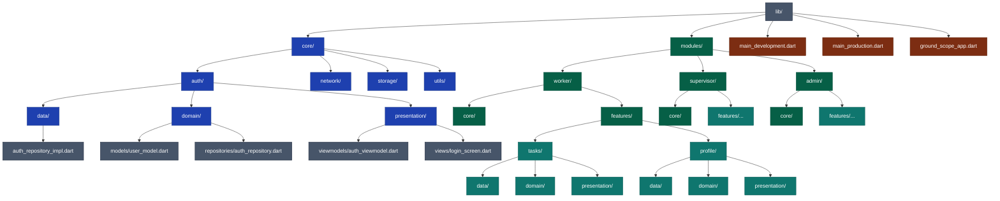

# GroundScope

**GroundScope** هو مشروع تخرج لجامعة الزقازيق الأهلية، ويهدف إلى إنشاء نظام متكامل لإدارة وتنظيم الخدمات الأرضية داخل المطارات، بما يشمل متابعة العمال، الإشراف، توزيع المهام، وإدارة العمليات.

## 📌 مقدمة

GroundScope عبارة عن تطبيق إداري متكامل يعتمد على واجهات مختلفة لكل نوع من المستخدمين:

* **Worker**: إدارة المهام اليومية للعمال.
* **Supervisor**: الإشراف على الفرق، مراجعة التقارير، توزيع المهام.
* **Admin**: التحكم الكامل بالنظام، إدارة المستخدمين، مراقبة العمليات، وإعداد التقارير.

## 🎯 أهداف المشروع

* تحسين تنظيم العمل داخل أرض المطار.
* رفع كفاءة التواصل بين العمال والمشرفين.
* توفير رؤية مركزية للإدارة.
* تقديم تقارير لحظية تساعد في اتخاذ القرارات.

## 🏗️ المعمارية المستخدمة

يعتمد المشروع على **Modular Architecture + MVVM** لضمان:

* قابلية التوسع.
* فصل المسؤوليات.
* سهولة إعادة الاستخدام.
* وضوح الهيكلة.

## 📁 هيكل المشروع (Project Structure)

```text
lib/
 ├── core/
 │    ├── auth/
 │    │    ├── data/
 │    │    ├── domain/
 │    │    └── presentation/
 │    ├── network/
 │    ├── storage/
 │    └── utils/
 │
 ├── modules/
 │    ├── worker/
 │    │    ├── core/
 │    │    └── features/
 │    ├── supervisor/
 │    │    ├── core/
 │    │    └── features/
 │    └── admin/
 │         ├── core/
 │         └── features/
 │
 ├── ground_scope_app.dart
 ├── main_development.dart
 └── main_production.dart
```

## 🧩 المزايا الرئيسية للتطبيق

* تخصيص واجهة لكل دور وظيفي.
* إدارة المهام في الوقت الحقيقي.
* إرسال واستقبال إشعارات.
* تسجيل حضور العمال.
* إنشاء تقارير مفصلة للإدارة.

## 🛠️ التقنيات المستخدمة

* **Flutter** (بناء الواجهات).
* **Dart** (لغة البرمجة).
* **MVVM Architecture**.
* **Modular Design**.
* **REST APIs**.

## 👥 الفريق

هذا المشروع تم تطويره بواسطة طلاب **جامعة الزقازيق الأهلية** ضمن مشروع التخرج.

## ✅ حالة المشروع

✅ قيد التطوير النشط.

## 📄 الترخيص (License)

هذا المشروع للاستخدام الأكاديمي فقط، وغير مخصص للنشر التجاري.

## 🎨 Design

> سيتم إضافة لقطات تصميم أو روابط لواجهات GroundScope هنا.
> (ضع هنا صور Figma أو UI Screens عندما تكون جاهزة)

---

## 🧱 Architecture Overview (Colored Mermaid Diagram)


