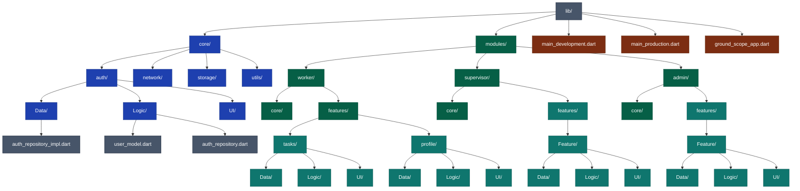

# GroundScope — Airport Ground Services Coordination System

> A real-time mobile platform for digitizing airport ground operations — built for Cairo International Airport (IATA: CAI).

**GroundScope** is a graduation project developed by students of **Zagazig National University**, providing a comprehensive system for managing and organizing **airport ground operations** — including task allocation, workforce monitoring, real-time incident reporting, flight schedule integration, and delay analytics.

---

## 📌 Introduction

GroundScope offers **three primary interfaces**, tailored to user roles:

- **Unit Manager (Worker):** Execute daily operational tasks with guided checklists, submit incident reports with photo evidence, and receive real-time task assignments.
- **Supervisor:** Monitor teams, assign tasks, acknowledge and resolve incident reports, and track live task progress across units.
- **Admin:** Full control over system settings, flight management, user creation, unit CRUD, and operational analytics — via the companion web dashboard.

---

## 🎯 Project Objectives

- Digitize the full flight turnaround lifecycle — from flight schedule ingestion to task completion and incident resolution.
- Improve real-time visibility for supervisors and administrators across all ground service units.
- Enforce role-based data isolation at the database level using Supabase Row Level Security (RLS).
- Enable structured incident reporting with photo evidence, severity levels, and a formal acknowledgment workflow.
- Support bilingual operations in English and Arabic with full RTL layout.
- Integrate with live flight data APIs to automate flight schedule ingestion.
- Enable delay analytics by comparing scheduled vs. actual timestamps per task per flight.

---

## 🏗️ Architecture

The project follows a **Modular Architecture + BLoC/Cubit pattern**, designed to:

- Facilitate scalability and future enhancements.
- Ensure clean separation between data, logic, and UI layers.
- Promote code reusability and maintainability.
- Support independent feature development across three user roles.
- Enable testability at the cubit and repository levels.

Every feature module follows a consistent `data / logic / ui` structure:

```
feature/
├── data/
│   ├── remote/   # Supabase API calls (FeatureRemoteDs)
│   └── repo/     # Abstract interface + implementation (FeatureRepoImpl)
├── logic/
│   └── cubit/    # FeatureCubit + FeatureState
└── ui/
    ├── feature_screen.dart
    └── widgets/
```

---

## 📁 Project Structure

```
lib/
├── core/                        # Shared infrastructure
│   ├── api/                     # Dio HTTP client (consumer, interceptors, factory)
│   ├── auth/                    # Authentication (login, auth gate, auth cubit)
│   ├── config/                  # AppConfig, FirebaseOptions
│   ├── di/                      # GetIt dependency injection
│   ├── error/                   # AppError, SupabaseErrorHandler
│   ├── localization/            # LocalizationManager
│   ├── networking/              # Supabase service client
│   ├── router/                  # Named routes + AppRouter
│   ├── service/                 # SecureStorage, SharedPrefs, UserService
│   ├── settings/                # AppSettingsCubit + AppSettingsState
│   ├── themes/                  # Colors, text styles, custom colors
│   ├── utils/                   # Spacing, extensions, helpers
│   ├── shared/data/models/      # Flight, Task, Unit, Report, etc.
│   ├── shared/data/remote/      # Shared Supabase data sources
│   ├── shared/data/repo/        # Shared repository interfaces
│   └── widgets/                 # Reusable UI components
│
├── modules/
│   ├── worker/                  # Unit Manager role (5 tabs)
│   │   ├── core/
│   │   └── features/
│   ├── supervisor/              # Supervisor role (5 tabs)
│   │   ├── core/
│   │   └── features/
│   └── admin/                   # Admin role (dashboard + feature cards)
│        ├── core/
│        └── features/
│
├── ground_scope_app.dart
├── main_development.dart
└── main_production.dart
```

---

## 🗺️ Architecture Diagram


```mermaid
flowchart TD
classDef core fill:#1e40af,stroke:#1e3a8a,color:#fff;
classDef module fill:#065f46,stroke:#064e3b,color:#fff;
classDef feature fill:#0f766e,stroke:#115e59,color:#fff;
classDef main fill:#7c2d12,stroke:#652b11,color:#fff;
classDef file fill:#475569,stroke:#1e293b,color:#fff;

LIB[lib/]:::file

LIB --> CORE[core/]:::core
CORE --> AUTH[auth/]:::core
AUTH --> AUTH_DATA[Data/]:::core
AUTH_DATA --> AUTH_IMPL[auth_repository_impl.dart]:::file
AUTH --> AUTH_LOGIC[Logic/]:::core
AUTH_LOGIC --> USER_MODEL[user_model.dart]:::file
AUTH_LOGIC --> AUTH_REPO[auth_repository.dart]:::file
AUTH --> AUTH_UI[UI/]:::core
CORE --> NETWORK[network/]:::core
CORE --> STORAGE[storage/]:::core
CORE --> UTILS[utils/]:::core

LIB --> MODULES[modules/]:::module

MODULES --> WORKER[worker/]:::module
WORKER --> WORKER_CORE[core/]:::module
WORKER --> WORKER_FEATURES[features/]:::module
WORKER_FEATURES --> TASKS[tasks/]:::feature
TASKS --> TASKS_DATA[Data/]:::feature
TASKS --> TASKS_LOGIC[Logic/]:::feature
TASKS --> TASKS_UI[UI/]:::feature
WORKER_FEATURES --> PROFILE[profile/]:::feature
PROFILE --> PROFILE_DATA[Data/]:::feature
PROFILE --> PROFILE_LOGIC[Logic/]:::feature
PROFILE --> PROFILE_UI[UI/]:::feature

MODULES --> SUPERVISOR[supervisor/]:::module
SUPERVISOR --> SUPERVISOR_CORE[core/]:::module
SUPERVISOR --> SUPERVISOR_FEATURES[features/]:::feature
SUPERVISOR_FEATURES --> SUP_FEATURE[Feature/]:::feature
SUP_FEATURE --> SUP_DATA[Data/]:::feature
SUP_FEATURE --> SUP_LOGIC[Logic/]:::feature
SUP_FEATURE --> SUP_UI[UI/]:::feature

MODULES --> ADMIN[admin/]:::module
ADMIN --> ADMIN_CORE[core/]:::module
ADMIN --> ADMIN_FEATURES[features/]:::feature
ADMIN_FEATURES --> AD_FEATURE[Feature/]:::feature
AD_FEATURE --> AD_DATA[Data/]:::feature
AD_FEATURE --> AD_LOGIC[Logic/]:::feature
AD_FEATURE --> AD_UI[UI/]:::feature

LIB --> MAIN_DEV[main_development.dart]:::main
LIB --> MAIN_PROD[main_production.dart]:::main
LIB --> MAIN_APP[ground_scope_app.dart]:::main
```

---

## 🛠️ Tech Stack

| Layer | Technology |
|---|---|
| Mobile Framework | Flutter (Dart) |
| State Management | BLoC / Cubit |
| Dependency Injection | GetIt |
| Backend | Supabase (PostgreSQL + Auth + Storage + RLS) |
| Push Notifications | Firebase Cloud Messaging (FCM) |
| Flight Data | AviationStack API |
| HTTP Client | Dio |
| Localization | easy_localization (EN + AR + RTL) |
| Responsive Layout | flutter_screenutil (390×844 base canvas) |
| Secure Storage | flutter_secure_storage |
| CI/CD | GitHub Actions |

---

## ✨ Key Features

- ✅ Real-time task lifecycle management (Create → Assign → Start → Pause → Complete)
- ✅ Structured incident reporting with photo evidence and severity levels
- ✅ Live updates via Supabase Realtime streams — no polling
- ✅ Role-based data isolation enforced at the database level (Supabase RLS)
- ✅ Bilingual support — English and Arabic with full RTL layout
- ✅ Automated flight schedule ingestion via AviationStack API
- ✅ Push notifications via Firebase Cloud Messaging
- ✅ Delay analytics — scheduled vs. actual timestamps per task per flight
- ✅ Secure JWT authentication stored with flutter_secure_storage
- ✅ Soft delete on all entities — no data loss on deactivation

---

## 🚀 Getting Started

### Prerequisites

- Flutter SDK 3.x / Dart SDK 3.x
- A Supabase project (PostgreSQL 15+, Auth enabled, Storage bucket: `report-images`)
- A Firebase project with FCM enabled
- An AviationStack API key

### Installation

```bash
# 1. Clone the repository
git clone https://github.com/a7medelbaz/GroundScope_Graduation_project.git
cd GroundScope_Graduation_project

# 2. Install dependencies
flutter pub get

# 3. Add Firebase config files
# Android: android/app/google-services.json
# iOS: ios/Runner/GoogleService-Info.plist

# 4. Configure Supabase and API keys in lib/core/config/app_config.dart

# 5. Run the app
flutter run -t lib/main_development.dart    # Development
flutter run -t lib/main_production.dart     # Production
```

---

## 📱 Device Requirements

| Requirement | Minimum | Recommended |
|---|---|---|
| OS | iOS 13+ / Android 6+ | iOS 16+ / Android 12+ |
| RAM | 2 GB | 4 GB+ |
| Storage | 50 MB free | 100 MB+ free |
| Network | 4G LTE | 5G / Wi-Fi |
| Camera | Required (incident photos) | 12 MP+ |

---

## 🎨 Screenshots

> UI screenshots will be added soon.

---

## 🔗 Related Repositories

| Repository | Description |
|---|---|
| [`groundscope-admin`](https://github.com/a7medelbaz/groundscope-admin) | Next.js 14 web admin dashboard |

---

## 👥 Team Members

This project was developed by a team of **9 students** from **Zagazig National University**:

1. Ahmed Elbaz Talba Elbaz Sobah
2. Mohamed Hosni Mohamed Hassan
3. Amr Mohamed Abdelhamid Badr
4. Abdullah Mohamed Abdullah Nour El-Din
5. Shaimaa Mohamed Suleiman Ibrahim
6. Alyaa Fayez Mohamed Mahmoud
7. Mahetab Abdelwahed Abdelmonem
8. Wissam Karam Shahata Ahmed El-Zuhairy
9. Nada Mohamed Gamal El-Bayoumi Mohamed

---

## 📄 License

This project is **for academic purposes only** and may not be used for commercial purposes.
